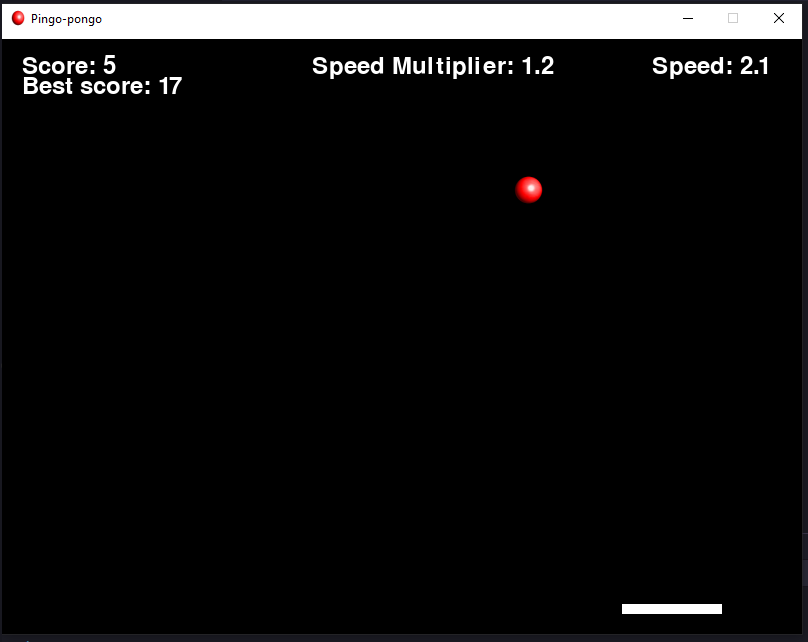

# Pingo-Pongo

---
## Overview

Pingo-Pongo is a classic arcade-style game that combines elements of ping pong and breakout. Players control a paddle to bounce a ball and break bricks, aiming for the highest score.

---
## Screenshots

Include screenshots or GIFs showcasing different aspects of your game.



---
## Installation

```bash
pip install pygame
git clone https://github.com/Armen-Jean-Andreasian/pingo-pongo.git
cd pingo-pongo
python main.py
```
---
---
## License

This project is licensed under the [GNU General Public License](LICENSE.md).

---
## Author: [Armen-Jean Andreasian](https://github.com/Armen-Jean-Andreasian)

